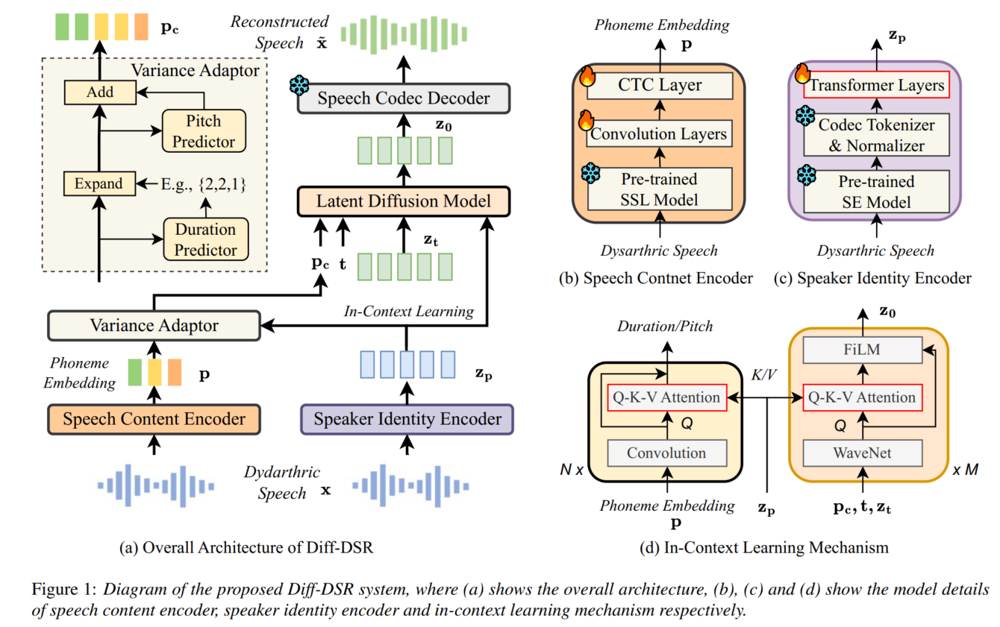

(Submitted on Interspeech 2025)

## 1. Abstract

Dysarthric speech reconstruction (DSR) aims to convert dysarthric speech into comprehensible speech while maintaining the speaker's identity. Despite significant advancements, existing methods often struggle with low speech intelligibility and poor speaker similarity. In this study, we introduce a novel diffusion-based DSR system that leverages a latent diffusion model to enhance the quality of speech reconstruction. Our model comprises: (i) a speech content encoder for phoneme embedding restoration via pre-trained self-supervised learning (SSL) speech foundation models; (ii) a speaker identity encoder for speaker-aware identity preservation by in-context learning mechanism; (iii) a diffusion-based speech generator to reconstruct the speech based on the restored phoneme embedding and preserved speaker identity. Through evaluations on the widely-used UASpeech corpus, our proposed model shows notable enhancements in speech intelligibility and speaker similarity.

## 2. Proposed Model Architecture

## 3. Comparison with Different Baseline Systems

3.1.1 **Speaker**: <i>M12</i> **Text**: <i>Left</i>  **Original Speech**: <audio controls><source src="./data/M12/Original/M12-left.wav" type="audio/wav"></audio>

<table class="custom-table">
  <thead>
  <tr>
    <th>FS2-DSR</th>
    <th>CoLM-DSR</th>
    <th>Diff-DSR</th>
  </tr>
  </thead>
  <tbody>
  <tr>
    <td><audio controls><source src="./data/M12/FS2-DSR/M12-left.wav" type="audio/wav"></audio></td>
    <td><audio controls><source src="./data/M12/CoLM-DSR/M12-left.wav" type="audio/wav"></audio></td>
    <td><audio controls><source src="./data/M12/Diff-DSR/M12-left.wav" type="audio/wav"></audio></td>
  </tr>
  </tbody>
</table>

